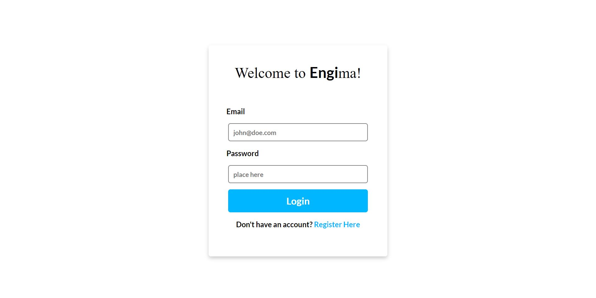
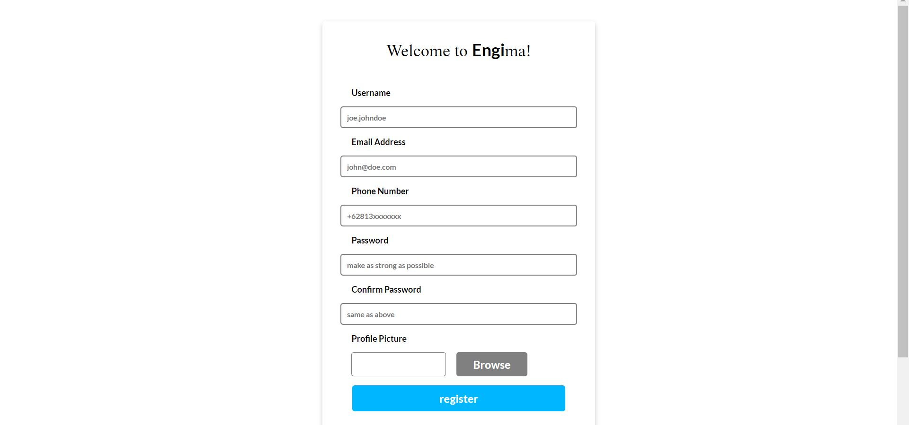
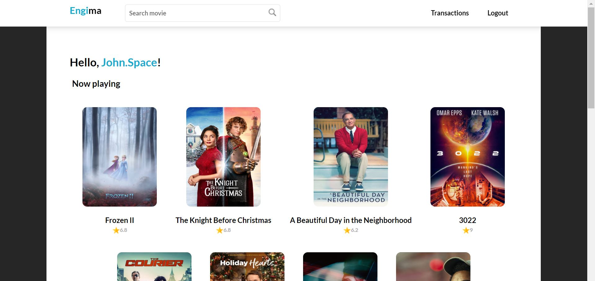
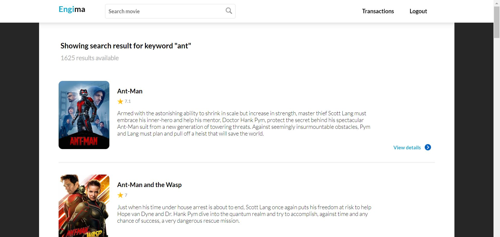
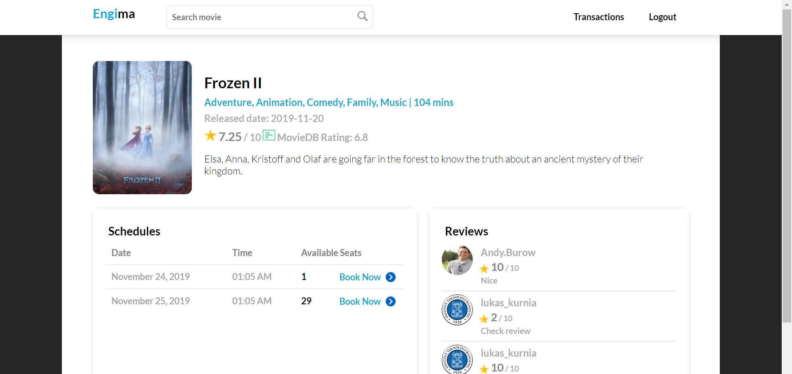
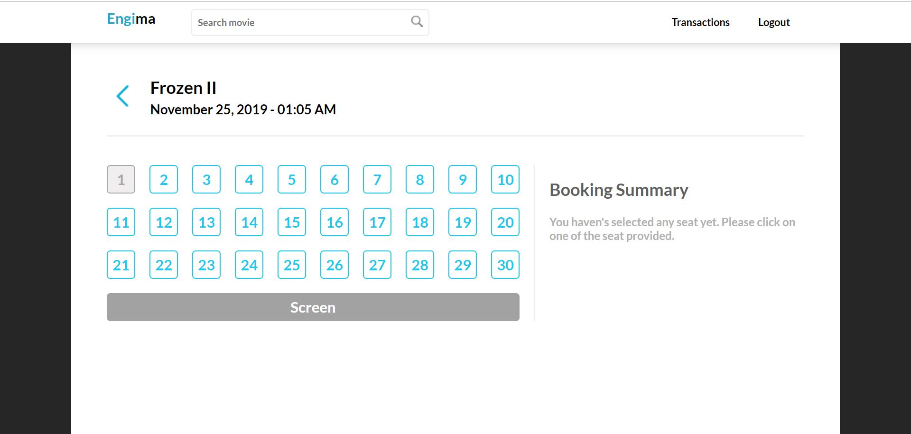
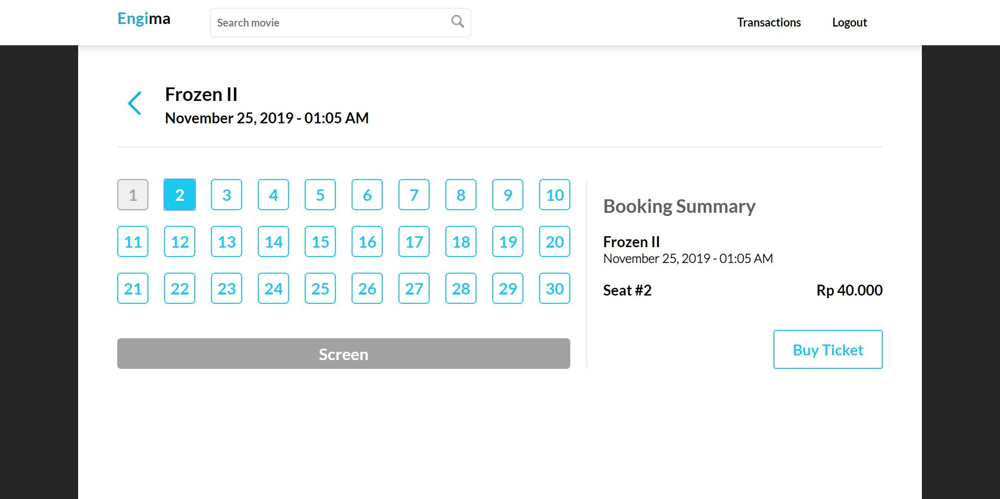
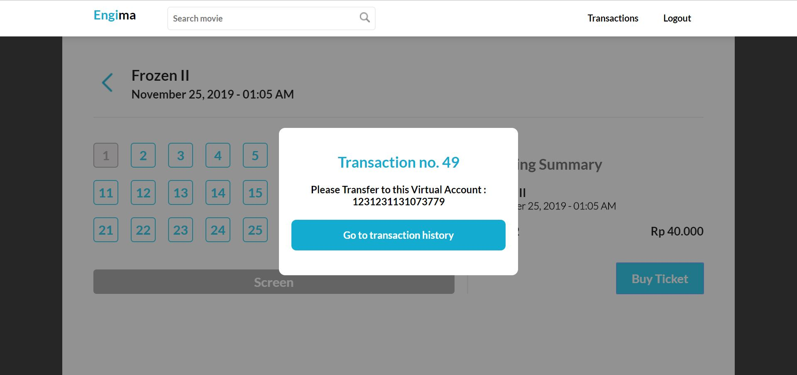
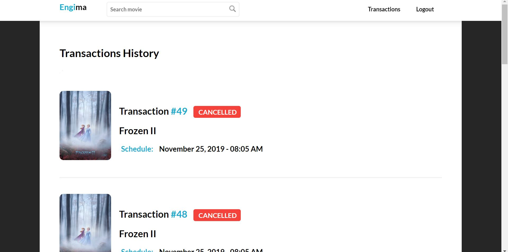
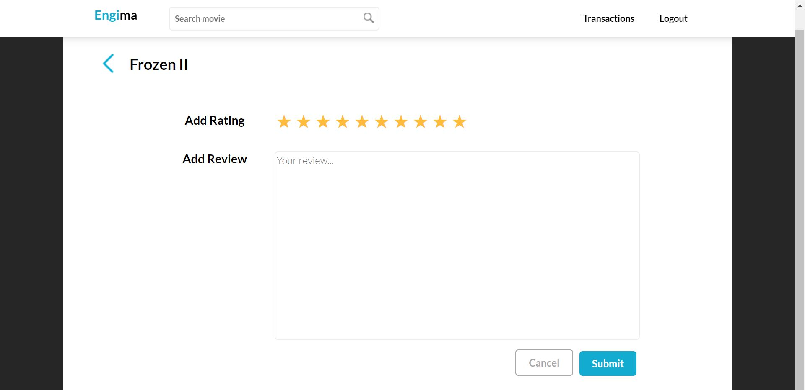

# Tugas 2 IF3110 Pengembangan Aplikasi Berbasis Web

## 1. Deskripsi Aplikasi Web

Setelah aplikasi web Engima diluncurkan, bioskop Engi menjadi sangat laku. Sebelumnya, Engi mengurus semua transaksi tiket film dan penambahan data film secara manual. Karena kewalahan, akhirnya Engi pergi ke seorang konsultan IT untuk menemukan solusi dari permasalahannya. Konsultan menyarankan Engi untuk menggunakan web service untuk mempermudah pekerjaannya. Melihat aplikasi web yang Anda kerjakan memuaskan, Engi meminta Anda untuk mengimplementasikan perubahan tersebut beserta web service dan aplikasi Bank yang digunakan untuk transaksi tiket film di Engima.

## 2. Basis Data

Database mysql dan konten tabel tidak berubah dengan tabel-tabel yang ada adalah movies, orders, rating, schedule, server_session, user_profile. namun tabel movies tidak digunakan.

## 3. Aplication MockUp
### Login Page

### Register Page

### Home Page

### Search Result page

### Film Detail page

### Buy Ticket page

### Transaction History page

### User Review page

## 4. Pembagian Tugas
Setiap anggota kelompok diwajibkan untuk mengerjakan bagian REST, SOAP, dan ReactJS. Jika Anda akan mengerjakan bonus, dicantumkan juga pembagian kerjanya.

Berikut adalah pembagian tugas sementara dari kelompok kami: 

### REST
1. Inisiator : 13516042
2. Menambah transaksi baru  : 13517084
3. Mengubah status transaksi   : 13517084
4. Mengembalikan seluruh data transaksi  : 13517006
5. TheMovieDB   : 13516125

### SOAP
1. Inisiator  : 13517006
2. Validasi  : 13516125
3. Memberikan data rekening : 13517084
4. Melakukan transaksi Transfer  : 13517006
5. Membuat akun virtual : 13517006
6. Cek Transaksi : 13516042

### REACTJS
1. Inisiator  : 13516125
2. Halaman Login : 13516125
3. Halaman Utama   : 13517084
4. Riwayat     : 13516042
5. Transfer    : 13517006

### Perubahan ENGIMA
1. Konektor ke WS Transaksi : 13516042
2. Konektor ke WS Bank  : 13517006
3. Perubahan Home   : 13517084
4. Perubahan Film Details   : 13516125
5. Perubahan Buy Ticket : 13516125
6. Perubahan Transaction History  : 13516125

## 5. Pembagian Tugas DPPL

1. CI/CD: 13517006
2. Eksplorasi dan setup mesin deployment: 13517006, 13517084
3. Unit testing: -

## 6. URL deployment aplikasi

Berikut ini URL deployment aplikasi untuk engima:
http://107.21.9.12/engima/src/components/login.php

## About

Kelompok 14 IF3110 - 2019

Lukas | Vijjasena | Aldo | Seldi
