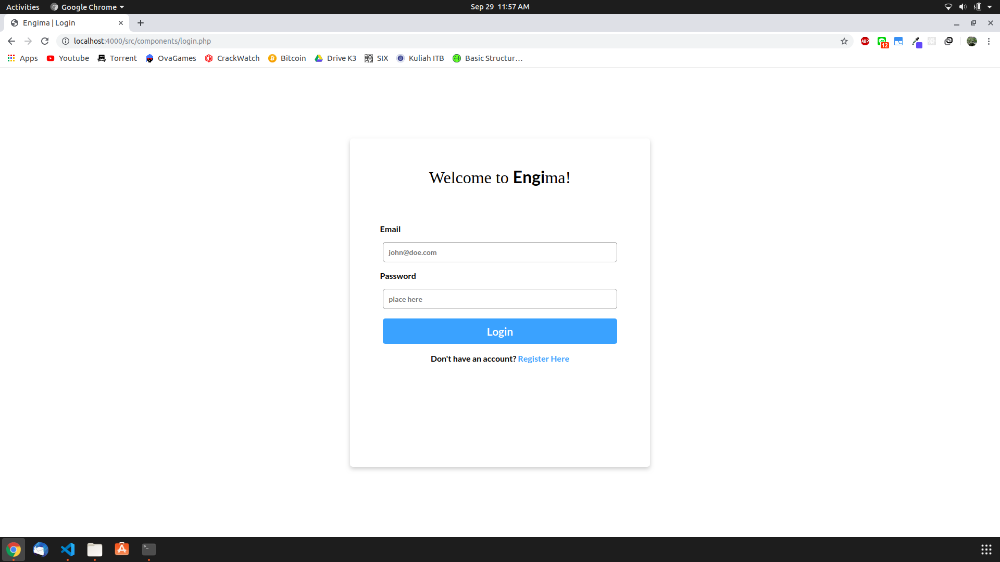
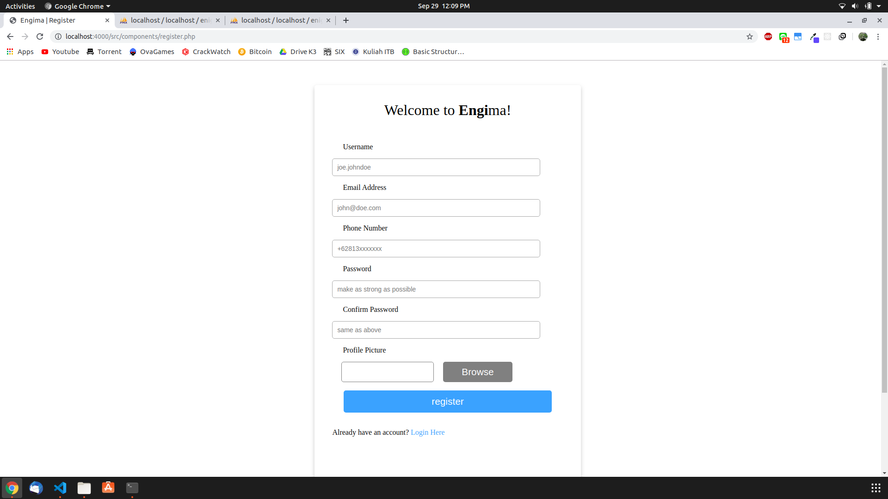
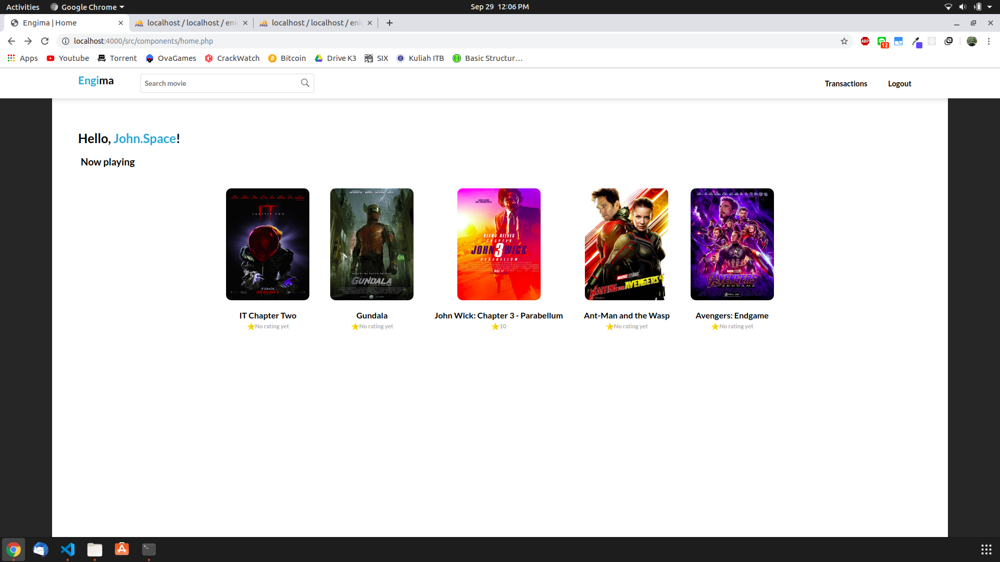
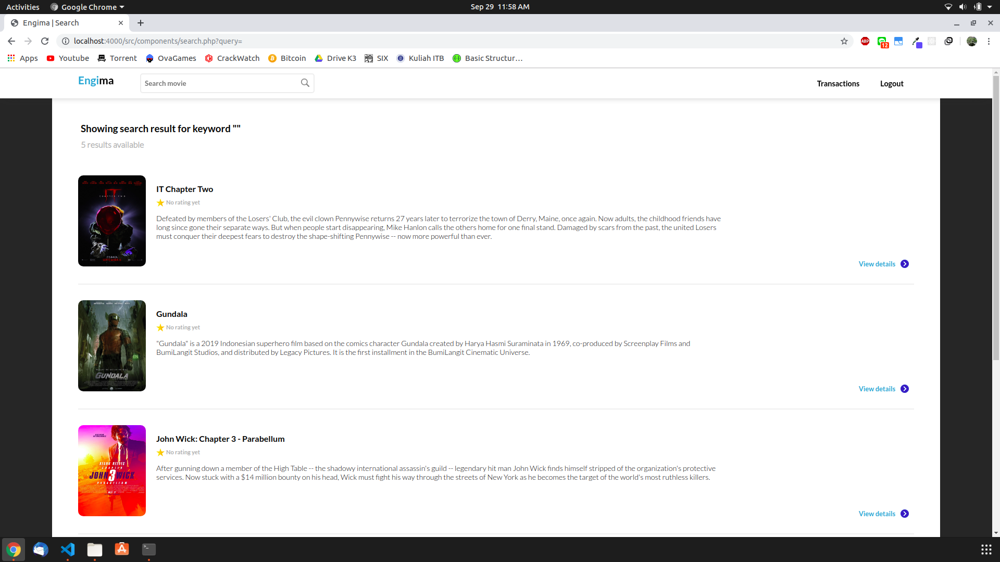
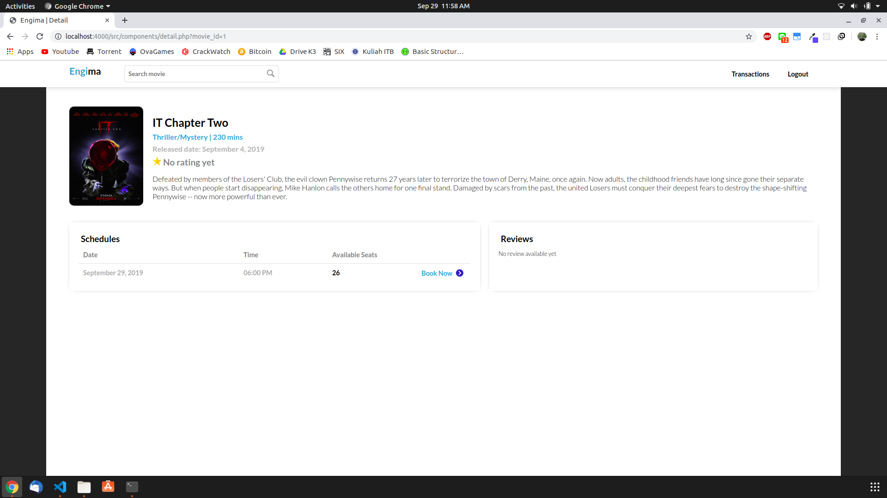
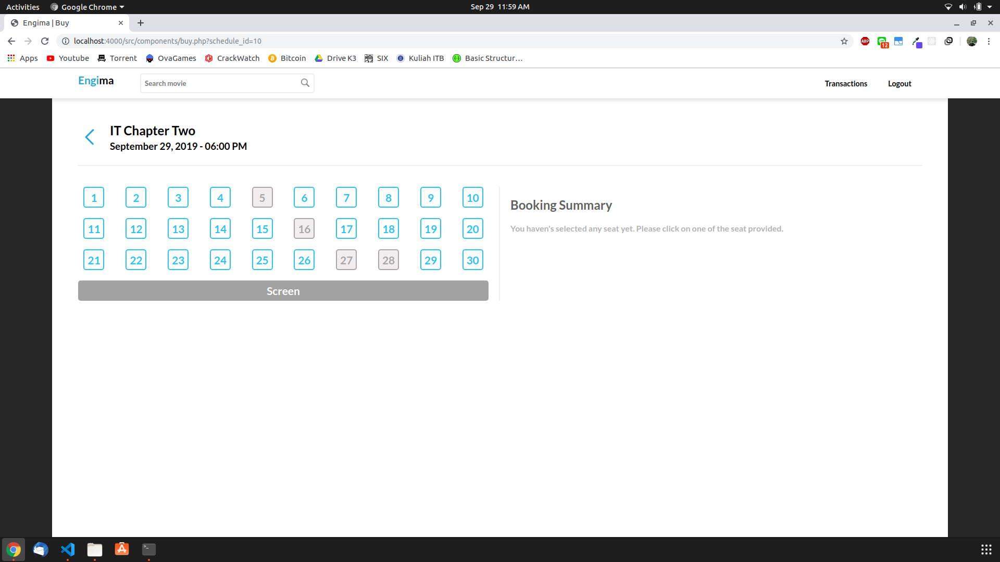
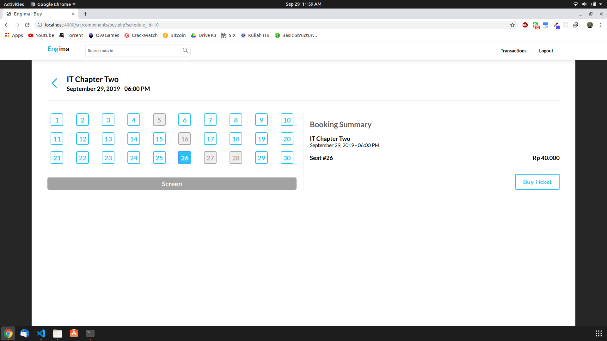
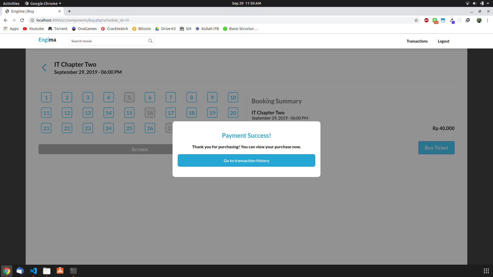
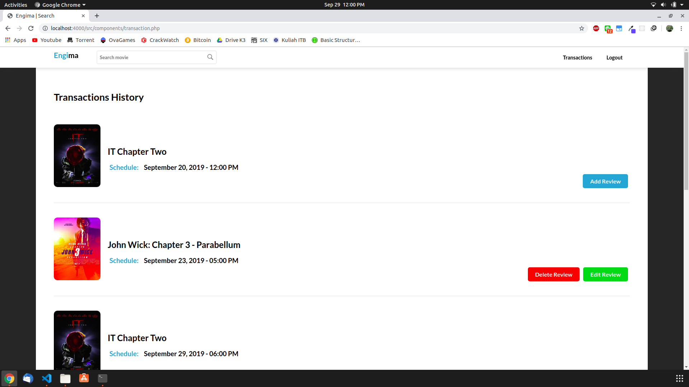

# Tugas 1 IF3110 Pengembangan Aplikasi Berbasis Web

## 1. Deskripsi Aplikasi Web

Saat ini Engi ingin melakukan ekspansi usaha dengan membangun sebuah bioskop. Setelah berdiri selama 2 bulan, Engi merasa bioskopnya sepi dibanding bioskop kompetitor lainnya. Usut punya usut, ternyata faktor utama penyebab sepinya bioskop Engi adalah tidak adanya kemudahan pemesanan tiket secara daring. Oleh karena itu, Engi meminta Anda untuk membuat aplikasi web pemesanan tiket bioskop daring. Engi menginginkan website miliknya untuk memiliki fitur pembelian tiket, memberi ulasan pada film yang telah ditonton, login dan register, riwayat pembelian tiket.

Engi telah mempekerjakan seorang UI/UX profesional untuk mendesain tampilan *website*-nya. Anda diminta untuk mengimplementasikan tampilan sedemikian mirip dengan tampilan pada contoh. Engi tidak meminta Anda untuk membangun *website* yang *responsive*. Icon dan jenis font tidak harus sama dengan contoh. Tata letak elemen, warna font, garis pemisah, dan perbedaan ukuran font harus terlihat sesuai contoh. Format rating dan waktu harus terlihat sesuai contoh tampilan.

## 2. Requirements and Installation
In order to run this web on your local server, you need to run it on **PHP 7.1** and install:

1. PHP 7.1
```
apt-get install php7.1
```
2. PDO Extension
```
apt-get install php7.1-pdo-mysql
```
3. MySql
```
apt-get install mysql
apt-get install mysql-server
```
4. XAMPP (alternative way from mysql)
Install XAMPP application at https://www.apachefriends.org/download.html

## 3. How to run server

1. Place the source code in  ..\xampp\htdocs directory
2. Run XAMPP
3. Try to open Engima in your browser in URL localhost

## 4. Aplication MockUp
### Login Page



### Register Page



### Home Page



### Search Result page



### Film Detail page



### Buy Ticket page







### Transaction History page



### User Review page


## 5. Pembagian Tugas
Setiap anggota kelompok **diwajibkan** untuk mengerjakan bagian frontend dan backend.

### Frontend
1. Login : 13516125
2. Register : 13516125
3. NavBar : 13517039
3. Home Page : 13517039
4. Search Page : 13517039
5. Film Detail Page : 13517039
6. Buy Ticket Page : 13517039
7. Transaction History : 13517150
8. User Review : 13517150, 13517039

### Backend
1. Login : 13516125
2. Register : 13516125
3. NavBar : 13516125
3. Home Page : 13516125, 13517039
4. Search Page : 13517039
5. Film Detail Page : 13517039
6. Buy Ticket Page : 13517039
7. Transaction History : 13517150
8. User Review : 13517150
9. Cookies Handler : 13516125
10. Database : 13516125, 13517039 , 13517150
11. APIs : 13517039

## About

Kelompok 3 IF3110 - 2019

Aldo | Ridwan | Steve 
